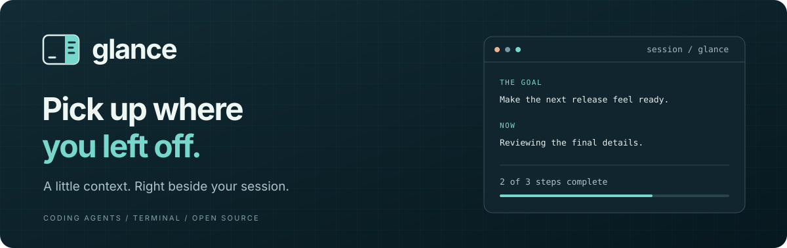
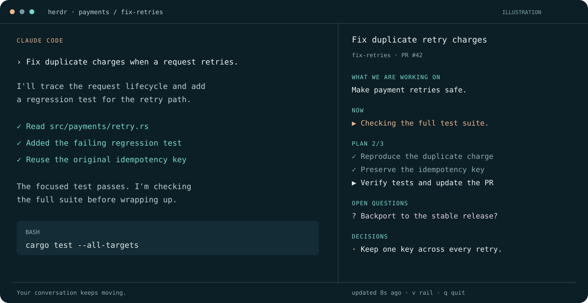
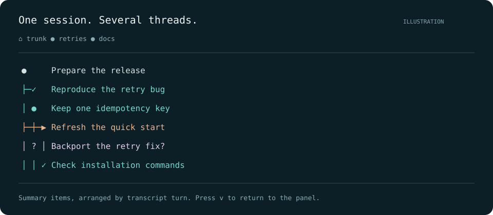

<div align="center">



[](https://github.com/adityamaanas/glance/actions/workflows/ci.yml)
[](LICENSE)
[](Cargo.toml)

**Your session, back in focus.**

A live panel beside Claude Code: the goal, the current work, the plan, and the loose ends.
Come back after a break without rereading the conversation.

[Quick start](#quick-start) · [User guide](docs/usage.md) · [How it works](docs/architecture.md) · [Roadmap](ROADMAP.md) · [Contribute](CONTRIBUTING.md)

</div>

---

## See the work at a glance



*Illustrative example using fictional session content. The terminal layout adapts to your pane.*

| Keep your bearings | Follow the details |
| :--- | :--- |
| **One stable goal.** Remember what the session is working toward. | **A living plan.** See completed steps, current work, and blockers. |
| **The open loops.** Keep unanswered questions and decisions in view. | **Separate workstreams.** Focus on one thread or see the whole session. |
| **A quick return.** Cached summaries appear when you reopen the panel. | **A second perspective.** Switch to the rail to see items arranged by workstream. |

Glance reads the transcript Claude Code already writes. It does not edit that transcript or direct the agent's work. Model summaries run through a separate `claude -p` invocation on your configured Claude login.

## Quick start

**Currently supported:** macOS and Linux, Claude Code 2.1, and [herdr](https://herdr.dev) 0.8+ for automatic pane attachment. Claude Code must be installed and logged in. Building from source requires a current stable Rust toolchain. Windows and additional agents are [planned](ROADMAP.md).

```sh
# Install from source
cargo install --git https://github.com/adityamaanas/glance

# Enable herdr's Claude integration
herdr integration install claude

# Run inside the herdr pane hosting Claude Code
glance-panel attach
```

In a running Claude Code conversation, use `! glance-panel attach` to run the command in that pane.

The first panel offers to open automatically for future sessions. Accept with `y`, or decline with `n`. Change this later with `glance-panel hook --install` or `glance-panel hook --uninstall`.

**Using another terminal?** Open your own split and follow a known session ID:

```sh
glance-panel --session <session-id>
```

Prebuilt binaries, Homebrew installation, and crates.io publication are planned. The installed binary is **`glance-panel`**.

## Small controls, useful context

| Key | Action |
| :--- | :--- |
| `j` / `k` | Scroll down / up |
| `r` | Request another summary |
| `v` | Toggle panel / rail view |
| `[` / `]` | Move between workstreams |
| `0` | Show all workstreams |
| `p` | Toggle pinned focus / follow the conversation |
| `q` | Quit |

<details>
<summary><strong>Explore the rail view</strong></summary>

<br>


The rail arranges summary items by transcript turn and workstream. A workstream is a thread of work, such as reviewing a PR; it is separate from a Git branch. Narrow panes fold extra lanes into a count. This illustration uses fictional content.

</details>

## Designed to stay out of the way

- Transcript metadata supplies the title, branch, linked PR, and other available fields.
- A background model pass updates the summary after activity settles, while herdr supplies working/idle status.
- Versioned caches live in `~/.glance/`; a heuristic provides initial context when no cache exists.
- `--no-model` displays metadata and cached context without starting a summary invocation.

Summaries are interpretations and can be incomplete or wrong. Check the conversation for consequential details. Read [privacy and data handling](docs/privacy.md) for what is read, saved, and passed to Claude.

## Find your way around

| Guide | What you will find |
| :--- | :--- |
| [Usage](docs/usage.md) | Attach, sessions, focus, configuration, and files |
| [Troubleshooting](docs/troubleshooting.md) | Empty panels, hooks, model failures, and recovery |
| [Architecture](docs/architecture.md) | Transcript → summary → terminal, and module boundaries |
| [Roadmap](ROADMAP.md) | Shipped capabilities and planned milestones |
| [Implementation checklist](docs/implementation-checklist.md) | Detailed work plan and validation gates |
| [Changelog](CHANGELOG.md) | Changes by version |

## Contributing

Bug reports, focused improvements, and documentation fixes are welcome. Start with the [contribution guide](CONTRIBUTING.md). Please use [private reporting](SECURITY.md) for security concerns.

Licensed under [Apache 2.0](LICENSE).
