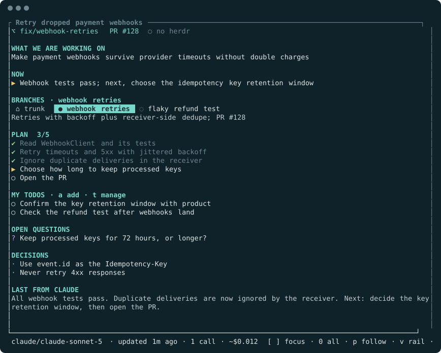
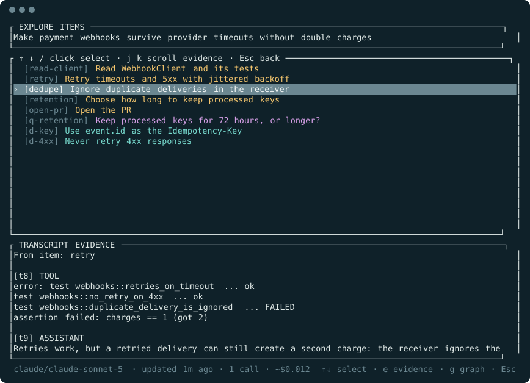
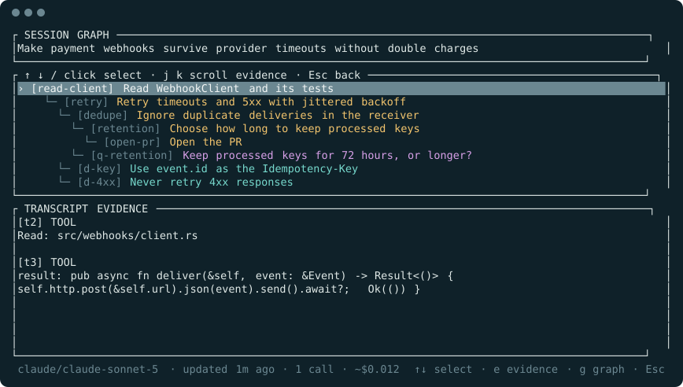
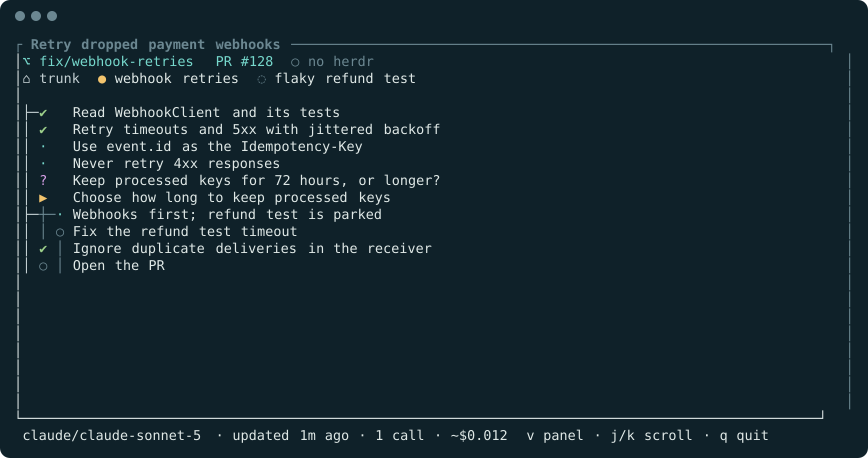
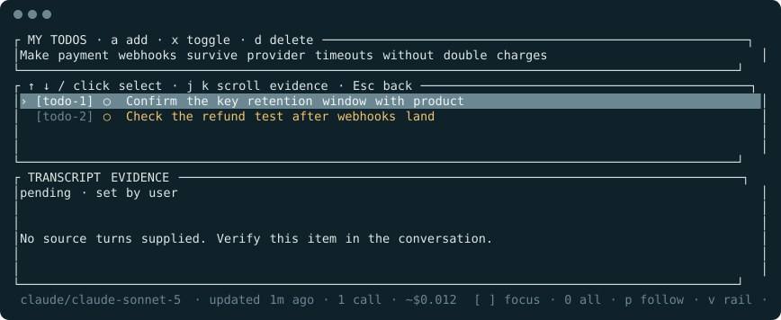

<div align="center">

# Glance

**Pick up where you left off.**

A live panel beside your coding agent that keeps the goal, the current step, the plan and the loose ends in view,<br>
so you can come back after a break without rereading the conversation.

[](https://github.com/adityamaanas/glance/actions/workflows/ci.yml)
[](LICENSE)
[](Cargo.toml)

[Getting started](docs/getting-started.md) · [Reading the panel](docs/reading-the-panel.md) · [Documentation](docs/README.md) · [Troubleshooting](docs/troubleshooting.md)



<sub>A real render of the panel, following a fictional session.</sub>

</div>

## Why Glance

Agent sessions get long. Twenty minutes in, the plan has changed twice, a question is still open, and a side quest is parked somewhere in the scrollback. Glance reads the transcript your agent already writes and keeps a short, checkable summary beside it:

- **The goal and the current step**, always at the top.
- **A living plan** with progress, plus open questions, decisions and blockers.
- **Evidence** for every item: the exact turns it came from.
- **Your own todos**, which the summary can tick off but never rewrite.

It reads only; it never types into your session or changes its files.

## Install

| Platform | Command |
| --- | --- |
| macOS and Linux | `curl --proto '=https' --tlsv1.2 -LsSf https://github.com/adityamaanas/glance/releases/latest/download/glance-panel-installer.sh | sh` |
| Windows (PowerShell) | `powershell -ExecutionPolicy Bypass -c "irm https://github.com/adityamaanas/glance/releases/latest/download/glance-panel-installer.ps1 | iex"` |
| From source ([Rust](https://www.rust-lang.org/tools/install) 1.88+) | `cargo install --locked --git https://github.com/adityamaanas/glance` |

The installers download a prebuilt binary for your platform (macOS Intel and Apple Silicon, Linux x86-64 and ARM64, Windows x86-64) into `~/.cargo/bin` and add it to your `PATH` if needed; no Rust is required. Check with `glance-panel --version`. Prefer to inspect first? Download the installer or an archive and its checksum from the [releases page](https://github.com/adityamaanas/glance/releases).

## Quick start

With [Claude Code](https://code.claude.com/docs) running in one pane, open a second pane in the same project and run:

```sh
glance-panel --cwd .
```

After the agent's next turn, the summary appears. The [getting-started tutorial](docs/getting-started.md) walks through it in ten minutes.

### Pick your setup

| You use | Run | Guide |
| --- | --- | --- |
| [herdr](https://herdr.dev) | `glance-panel attach`, or `glance-panel setup` to open it for every session | [herdr](docs/how-to/herdr.md) |
| tmux or Zellij | `glance-panel attach --backend tmux` (or `zellij`) | [Other terminals](docs/how-to/other-terminals.md) |
| Any other terminal | Open a split, then `glance-panel --cwd .` | [Other terminals](docs/how-to/other-terminals.md) |
| Codex, Gemini CLI, pi or OpenCode | Add `--harness codex` (or `gemini`, `pi`, `opencode`) | [Other agents](docs/how-to/other-agents.md) |
| Cursor IDE or CLI | `glance-panel setup --harness cursor`, then `--harness cursor --cwd .` | [Cursor](docs/how-to/cursor.md) |

Summaries use your agent's own CLI and login. Add `--no-model` to keep everything local.

## A quick tour

| | |
| :--- | :--- |
|  | **Check the evidence.** Press `Enter` on any item to see the transcript turns behind it. [More](docs/how-to/evidence-and-graphs.md) |
|  | **See how it fits together.** `g` shows which step each question or decision came from; `graph --html` exports it as an offline page. [More](docs/how-to/evidence-and-graphs.md) |
|  | **Follow separate threads.** Sessions that juggle several things are split into workstreams; the rail (`v`) shows them over time. [More](docs/reading-the-panel.md#workstreams-and-focus) |
|  | **Keep your own reminders.** `a` adds a todo in your words; the summary can only mark it done, with evidence. [More](docs/how-to/personal-todos.md) |

Every key is listed in the [keys reference](docs/reference/keys.md); the footer always shows the most useful ones.

## Good to know

- **Cost.** Each summary is one call to your agent's CLI, covering only the new turns, at most once every 30 seconds. The footer shows the count and the reported cost. [Spend less, or none](docs/how-to/run-without-models.md).
- **Privacy.** Glance has no service of its own. Conversation excerpts go only to the summary CLI you choose. [Details](docs/explanation/privacy.md).
- **Accuracy.** Summaries are interpretations and can be wrong. The evidence drawer is there to check them.
- **Compatibility.** Windows, macOS and Linux are tested in CI; live testing with each agent's latest version is still in progress. [Compatibility](docs/explanation/compatibility.md).

## Documentation

| Start | Do | Look up | Understand |
| --- | --- | --- | --- |
| [Getting started](docs/getting-started.md) | [herdr](docs/how-to/herdr.md) · [Other terminals](docs/how-to/other-terminals.md) | [Command line](docs/reference/cli.md) | [How it works](docs/explanation/how-it-works.md) |
| [Reading the panel](docs/reading-the-panel.md) | [Other agents](docs/how-to/other-agents.md) · [Cursor](docs/how-to/cursor.md) | [Keys](docs/reference/keys.md) | [Privacy](docs/explanation/privacy.md) |
| [Glossary](docs/glossary.md) | [Todos](docs/how-to/personal-todos.md) · [Summaries](docs/how-to/summary-providers.md) | [Configuration](docs/reference/configuration.md) | [Compatibility](docs/explanation/compatibility.md) |
| [Troubleshooting](docs/troubleshooting.md) | [No model calls](docs/how-to/run-without-models.md) · [Windows](docs/how-to/windows.md) | [Files and environment](docs/reference/files-and-environment.md) | [Roadmap](ROADMAP.md) · [Changelog](CHANGELOG.md) |

## Contributing

Bug reports, focused fixes and documentation improvements are welcome. Start with the [contribution guide](CONTRIBUTING.md), and report security issues privately through [SECURITY.md](SECURITY.md).

Licensed under [Apache 2.0](LICENSE).
