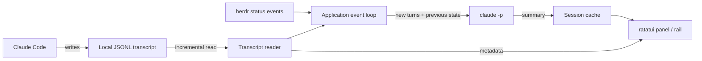

# Architecture

[← Home](../README.md) · [User guide](usage.md)

Glance is a Rust terminal application with one event loop and background workers for input, transcript polling, herdr status, and model execution.

## Boundaries

| Module | Responsibility |
| --- | --- |
| [`main.rs`](../src/main.rs) | CLI, attachment, state, workers, session following |
| [`transcript.rs`](../src/transcript.rs) | Discovery, appended JSONL reads, metadata, turn rendering |
| [`summary.rs`](../src/summary.rs) | Schema, normalization, model process, heuristic, versioned cache |
| [`herdr.rs`](../src/herdr.rs) | Unix socket requests, status subscription, pane CLI operations |
| [`setup.rs`](../src/setup.rs) | Hook settings and first-run preference |
| [`view.rs`](../src/view.rs) | Panel, focus, rail layout, footer |

## Update lifecycle

1. Resolve a session directly or through herdr, then load its transcript and cache.
2. Poll transcript size every 700 ms and ingest complete appended lines.
3. Wait for growth to settle and, when available, for herdr to stop reporting `working`.
4. Pass the previous summary and pending compact turns to a background Claude process.
5. Render the result and save a versioned cache for the next opening.

The summary contains a stable goal, current work, branches, plan items, questions, decisions, and blockers. Items carry a workstream and turn index. Unknown workstream references normalize to the trunk.

## Current limits

- The herdr transport requires Unix sockets; Windows support is planned.
- The parser omits tool-result bodies. Input rendering clips individual turns and retains only the end when a pass exceeds its budget.
- The rail shows the current summary; removed items do not remain as historical events.
- Tests cover parsing and view helpers. Process boundaries, hook preservation, and asynchronous transitions need broader coverage.

See the [implementation checklist](implementation-checklist.md) for reliability and compatibility work.
