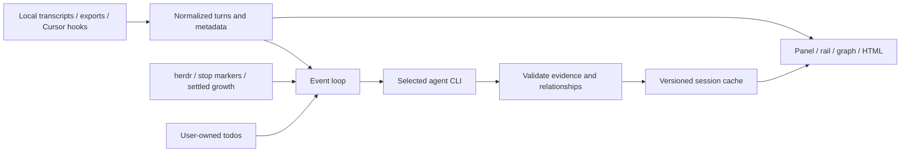

# Architecture

[← Home](../README.md) · [User guide](usage.md)

Glance is a Rust terminal application with an event loop and workers for
terminal input, transcript changes, agent status and summary execution.

## Boundaries

| Module | Responsibility |
| --- | --- |
| [main.rs](../src/main.rs) | CLI, state transitions, workers and session following |
| [harness.rs](../src/harness.rs) | Agent formats and transcript locations |
| [transcript.rs](../src/transcript.rs) | Claude incremental reading, normalized turns and excerpts |
| [opencode.rs](../src/opencode.rs) | Read-only SQLite ingestion, including committed WAL data |
| [cursor.rs](../src/cursor.rs) | IDE capture, CLI stream capture and hook ownership |
| [discovery.rs](../src/discovery.rs) | Bounded discovery and cwd filtering |
| [providers.rs](../src/providers.rs) | Summary CLI selection, isolation and response formats |
| [summary.rs](../src/summary.rs) | Schema, chunks, model execution, heuristics and caches |
| [evidence.rs](../src/evidence.rs) | References, relationship validation and offline export |
| [todos.rs](../src/todos.rs) | User wording, status provenance, locking and persistence |
| [herdr.rs](../src/herdr.rs), [transport.rs](../src/transport.rs) | Status/metadata over Unix sockets or Windows named pipes |
| [placement.rs](../src/placement.rs), [signals.rs](../src/signals.rs) | Split commands and activity signals |
| [setup.rs](../src/setup.rs), [view.rs](../src/view.rs) | Preferences/hooks and terminal rendering |

## Update lifecycle

1. Resolve an agent/session, read its transcript and load a matching cache.
2. Poll file size/modified time, including OpenCode's WAL. Claude appends are
   parsed incrementally; other adapters normalize a bounded snapshot.
3. Wait for activity to settle and enforce the refresh interval.
4. Send the previous summary, compact pending turns and user todos to a helper.
5. Validate references, reject stale generations, apply eligible todo status
   updates and atomically save the cache.

Cache fingerprints tie processed turns to visible transcript content. Claude
also verifies consumed bytes when reading a change, detecting earlier rewrites
with an unchanged tail. Rewinds and session changes invalidate in-flight work.
Prefix verification costs a sequential read on transcript changes.

Helpers run outside the project, with bounded pipe handling and a 150-second
deadline. Tool restrictions vary by provider and are not a universal OS sandbox.
Runtime/auth errors do not silently switch providers.

## Limits and validation

Forward chunks preserve access to early turns, but per-message excerpts are
clipped. Normalized adapters bound file ingestion. Views represent current
summary state; metadata and heuristics remain available without model calls.

Tests cover rewrites, asynchronous transitions, pipes, hooks, concurrent todo
writes, provider process contracts, fixtures and rendering geometry. See
[compatibility](compatibility.md) for live verification coverage.
