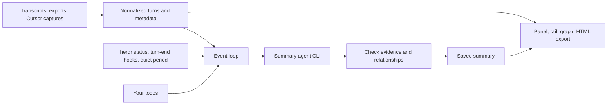

# How Glance works

[Docs home](../README.md) · [Privacy](privacy.md) · [Compatibility](compatibility.md)

This page explains what happens between your agent writing a transcript and the panel updating, and why Glance is built this way. You do not need it to use Glance.

## The idea

Coding agents already write every turn of a conversation to a file on disk. Glance reads that file, never the agent's screen and never its private state, and keeps a short, structured summary beside it. It does not type into your session, change the transcript, or steer the agent.

## Two kinds of information

**Read directly** from the transcript, free and instant: the title, git branch, linked PR, your first request and the agent's latest message. This is why the panel is useful before any summary exists, and with `--no-model`.

**Written by a model:** the goal, current step, workstreams, plan, questions, decisions and blockers. Glance runs a separate, restricted call to an agent CLI you already use (`claude -p`, `codex exec`, and so on), so it uses your existing login and no extra service is involved.

## When a summary runs

Summarizing a half-finished turn would describe work that is about to change, so Glance waits until:

1. the transcript has grown since the last summary,
2. the agent is not busy: herdr reports it idle, a turn-end hook fired, or the file has been quiet for two seconds,
3. at least `refresh_seconds` (30 by default) have passed since the last summary started.

Each summary call receives the previous summary, your todos and only the **new** turns, each labeled with its position (`[t42]`). Cost therefore grows with new conversation, not session length. Very long backlogs are processed in forward chunks, so early turns are never skipped, although individual long messages are shortened.

## Why evidence and IDs

Every item the model returns has a stable ID, the transcript turns that support it, and optionally the item it follows from. Glance checks these before saving: references to turns that do not exist are dropped, unknown parents are removed, and relationship loops are broken. The same checks protect your todos: the model may only change a todo's status, only with evidence newer than your last edit, and never its wording.

This makes summaries **checkable** rather than trusted. The evidence drawer shows the exact turns behind a claim.

## Staying correct as things change

- **Sessions change under the panel.** After `/clear` or a resume, herdr reports a new session and Glance switches. Any summary still being written for the old session is discarded when it arrives.
- **Transcripts can be rewritten.** Agents sometimes rewrite history (rewinds, rollbacks). Before reading appended data, Glance compares the last 4 KiB and one 4 KiB sample per MiB of what it has already read. If they differ, it re-reads from the start and rebuilds the summary. This costs about 0.4% of the file's size per change; an edit confined entirely to unsampled bytes would go unnoticed.
- **Caches must match their source.** Each saved summary records a fingerprint of the turns it covered. If the transcript no longer matches, the cache is ignored. The fingerprint uses a fixed hash function, so upgrading Glance or Rust does not invalidate caches.
- **Nothing is half-written.** Settings, caches and todos are replaced atomically, and todo edits from several panels or commands take a short lock.

## Running the summary agent safely

The summary call runs in a temporary directory outside your project, with tools disabled as far as each CLI allows, a 150-second limit and bounded output. If it fails, the previous summary stays and the footer shows the error; Glance never quietly switches to another provider. See [Choose who writes summaries](../how-to/summary-providers.md#how-each-agent-is-run) for what each agent is asked to disable.

## Where the code lives

| Module | Responsibility |
| --- | --- |
| [main.rs](../../src/main.rs) | Command line, panel state and workers, session following |
| [transcript.rs](../../src/transcript.rs) | Incremental reading, rewrite detection, normalized turns |
| [harness.rs](../../src/harness.rs), [opencode.rs](../../src/opencode.rs) | Agent formats and locations; read-only OpenCode database access |
| [cursor.rs](../../src/cursor.rs) | Cursor hook capture and CLI stream capture |
| [discovery.rs](../../src/discovery.rs) | Finding sessions by project or ID |
| [summary.rs](../../src/summary.rs), [providers.rs](../../src/providers.rs) | Summary schema, chunking, caches; running each agent CLI |
| [evidence.rs](../../src/evidence.rs) | Evidence and relationship checks; graph export |
| [todos.rs](../../src/todos.rs) | Personal todos, locking and status provenance |
| [herdr.rs](../../src/herdr.rs), [transport.rs](../../src/transport.rs) | herdr status over Unix sockets or Windows named pipes |
| [placement.rs](../../src/placement.rs), [signals.rs](../../src/signals.rs) | Opening splits; turn-end signals |
| [setup.rs](../../src/setup.rs), [view.rs](../../src/view.rs) | Configuration and hooks; drawing the screen |
