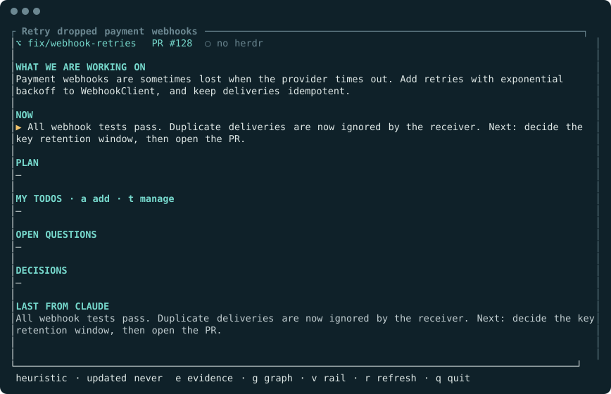

# Reading the panel

[Docs home](README.md) · [Keys](reference/keys.md) · [Glossary](glossary.md)

This page explains every part of Glance's screen. All screenshots are real renders of the current build, following a fictional session about retrying payment webhooks.

## The main panel

From top to bottom:

| Part | What it shows | Where it comes from |
| --- | --- | --- |
| **Title** (in the border) | The session's name: a title you set, or the agent's automatic title | Transcript |
| **Header line** | `⌥` git branch or worktree, linked `PR #`, and the agent's live state | Transcript; state from herdr |
| **WHAT WE ARE WORKING ON** | One sentence: the goal of the whole session. It only changes when the goal changes. | Summary |
| **NOW** | What is happening right now, or what just finished | Summary |
| **BRANCHES** | The session's [workstreams](glossary.md#workstream), shown only when there is more than one. The highlighted chip is the one in focus, and its one-line summary appears underneath. | Summary |
| **PLAN 3/5** | Steps with done/total counts for the focused workstream | Summary |
| **MY TODOS** | Your own reminders. Only you write them. | You ([how-to](how-to/personal-todos.md)) |
| **OPEN QUESTIONS** | Questions still waiting for an answer | Summary |
| **DECISIONS** | Choices already made, so you don't reopen them | Summary |
| **BLOCKED ON** | What is stopping progress, shown only when something is | Summary |
| **LAST FROM CLAUDE** | The agent's most recent message (the heading names your agent) | Transcript |
| **Footer** | Who wrote the summary, how long ago, call count and estimated cost, status messages, and the most useful keys | Glance |

A dash (`–`) means the section is empty.

### Symbols

| Symbol | Meaning |
| --- | --- |
| ✔ | Done |
| ▶ | In progress (in NOW: the current step) |
| ○ | Not started |
| ✖ | Blocked |
| ? | Open question |
| · | Decision |
| ! | Blocker |
| `[name]` before an item | The workstream it belongs to, shown when all workstreams are visible |

### Agent state in the header

herdr reports whether the agent is busy. Without herdr, the header shows `○ no herdr` and Glance relies on the transcript going quiet instead.

| Header | Meaning |
| --- | --- |
| `● working` (yellow) | The agent is mid-turn. Glance waits before summarizing. |
| `● idle` (green) | Waiting for your next prompt |
| `● needs you` (red) | herdr reports the agent as blocked, usually waiting for your input |
| `● done` (blue) | herdr reports the agent as done |
| `○ no herdr` | Not running under herdr |

### The footer

`claude/claude-sonnet-5 · updated 1m ago · 1 call · ~$0.012` means:

- **`claude/claude-sonnet-5`**: the summary agent and model that wrote this summary. `heuristic` means no summary exists yet, so the panel shows fields read straight from the transcript.
- **`updated 1m ago`**: when the summary was last written (`never` before the first one).
- **`1 call · ~$0.012`**: summary calls for this session and the cost the agent's CLI reported. A trailing `+` means some calls reported no cost, so the real total is higher. This is an estimate, not a bill.

Status messages also appear here:

| Footer message | Meaning |
| --- | --- |
| `⟳ analyzing…` | A summary is being written |
| `waiting for the first prompt` | The session has no transcript yet; send your first prompt |
| `⚠ …` (red) | The last summary attempt failed; the previous summary stays visible. See [Troubleshooting](troubleshooting.md#the-summary-never-updates-or-shows-an-error). |
| `pinned` | Focus is fixed on a workstream and will not follow the conversation (`p` toggles) |

## Before the first summary

Until a summary exists, WHAT WE ARE WORKING ON shows your first request and NOW shows the agent's latest message. The footer says `heuristic`. With `--no-model` the panel stays like this, apart from any summary cached earlier.

## Workstreams and focus

A long session often covers several separate things, such as a bug fix and a flaky test. The summary groups items into [workstreams](glossary.md#workstream), which the panel labels **BRANCHES**. They are threads of work, not git branches.

By default the panel **follows the conversation**: it focuses the workstream the newest turns belong to, showing that workstream's items plus general ("trunk") items. Use `[` and `]` to move focus yourself, `0` to show everything, and `p` to return to following. Older finished workstreams collapse into a `+N done` chip.

## Evidence

Press `Enter` or `↓` to open the item list. Each item links to the transcript turns (`[t8]`, `[t9]`, …) that support it, shown in the lower box. `From item:` names the step it follows from. `j`/`k` scroll the evidence.

Evidence shows where a claim came from, not that it is true. If an item has no supporting turns, the drawer says so.

## Graph

Press `g` to see how items relate: each is indented under the step it follows from. Export the same graph as a standalone web page with `glance-panel graph --session <session-id> --html` ([how-to](how-to/evidence-and-graphs.md)).

## Rail

Press `v` for the rail: every item in the order it arose, with one lane per workstream. Use it to see how the session unfolded over time. Press `v` again to return.

## Todo list

Press `t` to manage your reminders: `x` toggles done, `d` deletes, `a` adds. The lower box shows who last changed the status (you or the summary) and, for summary changes, the supporting turns. See [Keep personal todos](how-to/personal-todos.md).
